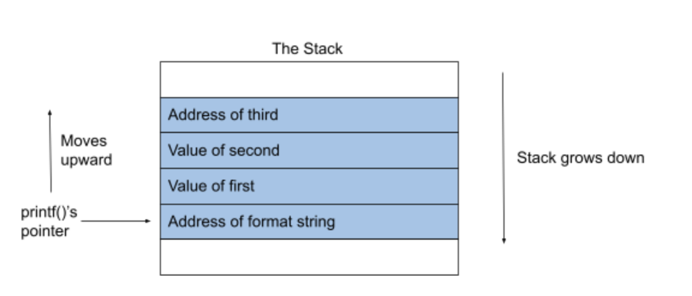
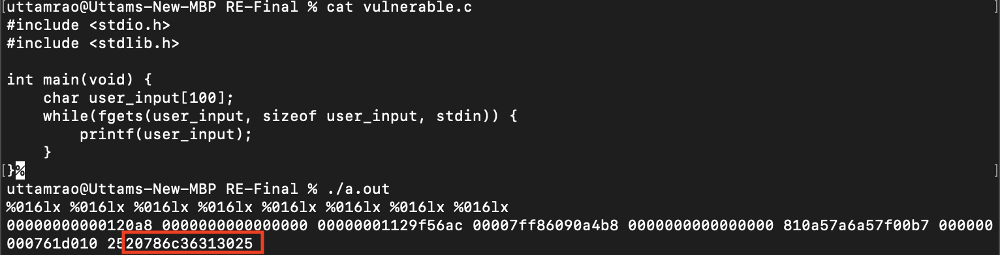

# Format String Exploitation
### Uttam Rao (COSC 69) Final Project

## What is a format string?

A format string is a string which contains format specifiers and is used in format functions. In this writeup we look at format functions in C, but the same kind of functions exist in many other programming languages. Below is an example

```
printf(“The name of this class is %s.\n”, class_name);
```

If the variable class_name is set to the string “COSC 69” the above statement will print 

```
The name of this class is COSC 69.
```

%s indicates that the data is a pointer to the string. Besides %s there are several other format specifiers. They are summarized in the table below

| Specifier | Format | Meaning | Passed as |
| - | - | - | - |
| %s | string ((const) (unsigned) char *) | data should be pointer to a string | reference |
| %d | decimal (int) | signed integers in decimal | value |
| %u | unsigned decimal (unsigned int) | unsigned integer in decimal| value |
| %x | hexadecimal (unsigned int) | unsigned integer in hex| value |
| %n | number of bytes written so far, (* int) | special case: stores number of bytes written so far in argument | reference |

## The role of the stack

printf() takes a variable number of arguments and scans the format string for format specifier to determine the number of arguments. Where are these arguments located? The calling conventions are different based on the systems being used but at least some arguments are always taken from the stack. For this writeup, knowledge of how the stack works is assumed so a detailed explanation of how the stack works is skipped. Generally speaking, when a local variable or a function argument is declared it gets pushed onto the stack. See the simple example below

```
printf(“The value of first is %d, the value of second is %d, the address of third is %08x.”, first, second, &third);
```


## So what's the issue?

Format functions can be exploited in a number of ways when an adversary is given control over the format string fed into the function, for example, when a program asks for user input. We’ll start with the simplest and arguably the least harmful of the exploits: leaking program information. This can happen when the format string has more specifiers than the number of arguments that are actually provided.

```
printf(“The value of first is %d, the value of second is %d, the value of third is %x.”, first, second)
```

The above example only has 2 arguments, but the format string asks for 3. printf() will still try to get 3 values from the stack. Since only 2 of those are an actual function argument, the third will be replaced by whatever is next on the stack. In the above example, the next value on the stack will be printed in hex. Although some compilers might display a warning for the above example (2 out of the 3 I tried), since printf() is a function with a variable number of arguments by definition, the code will still compile with no issues. In the above example, the format string is a constant string. It’s even harder for a compiler to detect a potential issue when the format string is generated when the program is running, for example, with user input. Consider the following code

```
int main(int argc, char **argv){
    char user_input[100];
    printf("Please enter a string\n");
    //get string from user
    scanf("%s", user_input);
    // the vulnerability
    printf(user_input); 
    return 0;
}
```

If the user inputs “%x%x%x%x%x%x%x%x%x%x%x%x%x%x%x%x%x%x%x%x” they will see the next 20 items on the stack and with “%10$x” they will see the tenth element away on the stack. This can lead to leaking program information like return addresses and local variables. 

Now let's look at a real example. 


The above was compiled on an x86-64 Linux. As mentioned above the calling conventions are different based on the systems used. For example, with x86-64 on Linux, the second to sixth arguments come from registers and not the stack, so we have to skip over these to get to the stack. The registers are rsi, rdx, rcx, r8, and r9 (highlighted in green). The ASCII for “%016lx” is highlighted in yellow and the 16 bytes of the stack after the return address are highlighted in orange. Below is the same on my mac machine. As can be seen, it is extremely similar but in a different format. The ASCII for “%016lx” is circled in red.



### Looking at data at any address

Remember that %s indicates a string passed by reference, meaning the data on the stack is treated as an address to go fetch the string from. We can use this to look at data at any location in memory since we control the format string and can use it to place any address on the stack. 

```
printf(“\xad\xde\xad\xde%x%x%x%s”, first, second, third);
```

The above will print the string located at the address 0xdeaddead. The three %x’s are there to get to move the stack pointer towards the format string (of course this will be different for each case). The %s will use the first 4 bytes of the format string as the address of the string that needs to be printed. 

### Writing values

Viewing the stack, leaking program information, and even looking at strings at any address are all issues, but they aren’t so bad, right? Well, the actual problem with format strings is much much worse. Because of the “%n” format specifier, we can actually write values and overwrite memory at any location, which allows us to crash a program with such a vulnerability or even modify data to predetermined values. From the printf() manpage we can see that “%n” is a special case specifier which stores the number of characters written so far into the integer pointed to by the corresponding argument. Below is a simple example:
```
int target
printf(“123%n”, &target);
```

will set the integer target to 3. Width controlling and length controlling specifiers allow an adversary to reach arbitrary locations (even if the buffer is too small for the number of padding characters) and control exactly how much data is written to the location. For example:

```
printf(“%11d%n”, 1, &target);
printf(“%11d%hn”, 1, &target);
```

The first line above will set the integer target to 11 and write 4 bytes. The second line will only write 2 bytes.

## A short exercise

```
#include <stdlib.h> 
#include <stdio.h>

int main(void) {
    char user_input[100];
    while(fgets(user_input, sizeof user_input, stdin)) {
        printf(user_input);
    }
}

int get_to_this_func() { 
    printf("You did it!\n");
    exit(0); 
}
```


