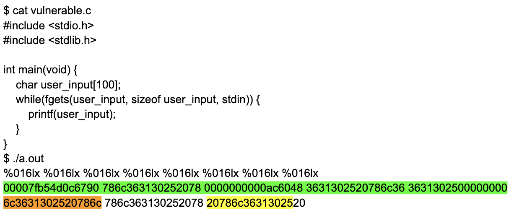

# Format String Exploitation Writeup
### Uttam Rao (COSC 69) Final Project

In my final project, I delve into the format string exploitation. This writeup contains background on the exploitation, its relevance today, some examples, some defenses, and a simple exercise. 

## What is a format string?

A format string is a string which contains format specifiers and is used in format functions. In this writeup we look at format functions in C, but the same kind of functions exist in many other programming languages. Below is an example

```
printf(“The name of this class is %s.\n”, class_name);
```

If the variable class_name is set to the string “COSC 69” the above statement will print 

```
The name of this class is COSC 69.
```

%s indicates that the data is a pointer to the string. Besides %s there are several other format specifiers. They are summarized in the table below

| Specifier | Meaning | Passed as |
| - | - | - | 
| %s | data should be pointer to a string | reference |
| %d | signed integers in decimal | value |
| %u | unsigned integer in decimal| value |
| %x | unsigned integer in hex| value |
| %n | special case: stores number of bytes written so far in argument | reference |

## The role of the stack

printf() takes a variable number of arguments and scans the format string for format specifier to determine the number of arguments. Where are these arguments located? The calling conventions are different based on the systems being used but at least some arguments are always taken from the stack. For this writeup, knowledge of how the stack works is assumed so a detailed explanation of how the stack works is skipped. Generally speaking, when a local variable or a function argument is declared it gets pushed onto the stack. See the simple example below

```
printf(“The value of first is %d, the value of second is %d, the address of third is %08x.”, first, second, &third);
```


## So what's the issue?

Format functions can be exploited in a number of ways when an adversary is given control over the format string fed into the function, for example, when a program asks for user input. We’ll start with the simplest and arguably the least harmful of the exploits: leaking program information. This can happen when the format string has more specifiers than the number of arguments that are actually provided.

```
printf(“The value of first is %d, the value of second is %d, the value of third is %x.”, first, second)
```

The above example only has 2 arguments, but the format string asks for 3. printf() will still try to get 3 values from the stack. Since only 2 of those are an actual function argument, the third will be replaced by whatever is next on the stack. In the above example, the next value on the stack will be printed in hex. Although some compilers might display a warning for the above example (2 out of the 3 I tried), since printf() is a function with a variable number of arguments by definition, the code will still compile with no issues. In the above example, the format string is a constant string. It’s even harder for a compiler to detect a potential issue when the format string is generated when the program is running, for example, with user input. Consider the following code

```
int main(int argc, char **argv){
    char user_input[100];
    printf("Please enter a string\n");
    //get string from user
    scanf("%s", user_input);
    // the vulnerability
    printf(user_input); 
    return 0;
}
```

If the user inputs “%x%x%x%x%x%x%x%x%x%x%x%x%x%x%x%x%x%x%x%x” they will see the next 20 items on the stack and with “%10$x” they will see the tenth element away on the stack. This can lead to leaking program information like return addresses and local variables. 

Now let's look at a real example [1]. 


The above was compiled on an x86-64 Linux. As mentioned above the calling conventions are different based on the systems used. For example, with x86-64 on Linux, the second to sixth arguments come from registers and not the stack, so we have to skip over these to get to the stack. The registers are rsi, rdx, rcx, r8, and r9 (highlighted in green). The ASCII for “%016lx” is highlighted in yellow and the 16 bytes of the stack after the return address are highlighted in orange. Below is the same on my mac machine. As can be seen, it is extremely similar but in a different format. The ASCII for “%016lx” is circled in red.


### Looking at data at any address

Remember that %s indicates a string passed by reference, meaning the data on the stack is treated as an address to go fetch the string from. We can use this to look at data at any location in memory since we control the format string and can use it to place any address on the stack. 

```
printf(“\xad\xde\xad\xde%x%x%x%s”, first, second, third);
```

The above will print the string located at the address 0xdeaddead. The three %x’s are there to get to move the stack pointer towards the format string (of course this will be different for each case). The %s will use the first 4 bytes of the format string as the address of the string that needs to be printed. 

### Writing values

Viewing the stack, leaking program information, and even looking at strings at any address are all issues, but they aren’t so bad, right? Well, the actual problem with format strings is much much worse. Because of the “%n” format specifier, we can actually write values and overwrite memory at any location, which allows us to crash a program with such a vulnerability or even modify data to predetermined values. From the printf() manpage we can see that “%n” is a special case specifier which stores the number of characters written so far into the integer pointed to by the corresponding argument. Below is a simple example:
```
int target
printf(“123%n”, &target);
```

will set the integer target to 3. Width controlling and length controlling specifiers allow an adversary to reach arbitrary locations (even if the buffer is too small for the number of padding characters) and control exactly how much data is written to the location. For example:

```
printf(“%11d%n”, 1, &target);
printf(“%11d%hn”, 1, &target);
```

The first line above will set the integer target to 11 and write 4 bytes. The second line will only write 2 bytes.

## A short exercise

Consider the following code. Compile it and look at the global offset table. Your task is to replace the pointer to fgets() with a pointer to get_to_this_func() using a format string attack. Reading this additional tutorial may also prove helpful: http://www.infond.fr/2010/07/tutorial-exploitation-format-string.html. Remember that there are differences between 32 and 64 bit x86 as noted above.

```
#include <stdlib.h> 
#include <stdio.h>

int main(void) {
    char user_input[100];
    while(fgets(user_input, sizeof user_input, stdin)) {
        printf(user_input);
    }
}

int get_to_this_func() { 
    printf("You did it!\n");
    exit(0); 
}
```
Note: The following section describes some built in defenses to the format string exploitation in many modern systems. You may need to turn some off just to do the exercise above.


## History, relevance, and defenses

The vulnerability of format strings was first discovered in 1989 and originally thought to be harmless. Beginning in 1999 (starting with Tymm Twillman) and in the few years after that, several blogposts, articles, and papers were released detailing the use of format strings for adversarial attacks. Links to some of these follow below

Famous phrack article (2002) - http://phrack.org/issues/59/7.html

Tymm Twillman original attack (1999) - https://seclists.org/bugtraq/1999/Sep/328

Famous attack by Przemislaw Frasunek (2000) - https://marc.info/?l=bugtraq&m=96179429114160&w=2

Famous paper by team Teso (2001) - https://cs155.stanford.edu/papers/formatstring-1.2.pdf

Tim Newsham (2000) - http://forum.ouah.org/FormatString.PDF

### Defenses

Given that this exploitation was discovered over twenty years ago, of course there are a few defenses against it. 

The first defense is to fix the issue between the keyboard and the chair, i.e. for the developer to avoid using user inputs for format strings in format functions like printf(). Format strings show that no bug is too small to be exploited. Careful programming is always necessary.

Another defense is for the compiler to detect the potential vulnerability and warn the developer. Many, but not all, compilers do this kind of analysis nowadays, but since there are still no compilation errors this might be easy to miss. 

Another defense is to implement some system countermeasures like address randomization (ASLR), data execution preventions (DEP), and a few other guards. While these may make the attack considerably more difficult and protect against some facets of the attack, they do not make it impossible. In particular, relatively recent work (2017 and later) by Mathias Payer on string oriented programming have shown ways to circumvent ASLR, DEP, and other guards. See the links below 

https://nebelwelt.net/files/11CCC-presentation.pdf
https://nebelwelt.net/files/13PPREW-presentation.pdf

Interesting fact:
Mathias Payer and Nicholas Carlini showed that printf() is Turing complete when called in a loop. They created their own Turing-complete language to take advantage of this. The name of the language is a little crude so it is omitted here, but you can check it out for yourself at their github repo at the link below 

https://github.com/HexHive/printbf

Modern Linux also has some other defenses like not allowing format strings to have “%n” if it is in writable memory as well as adding bounds checks to some standard library functions. In particular _FORTIFY_SOURCE may be set to 2 in the standard C library (you may need to change this to do the simple exercise in the previous section).

### Relevance

Given that the format string attack has been around for decades and is pretty widely known and avoidable through careful programming, is it still relevant today? Are there still high profile occurrences of this vulnerability?

Turns out the answer is yes. As recently as last year, iOS and macOS had a format string bug that permanently disabled the wifi functionality of an iPhone [4]. The following screenshot is from twitter: https://twitter.com/vm_call/status/1405937492642123782. 


## Sources

In addition to the various links mentioned throughout this writeup I also used the following resources for information, some very simple code snippets, and for finding recent cases of the vulnerability.

[1] https://www.cs.virginia.edu/~cr4bd/4630/S2017/slides/20170320-slides-1up-animated.pdf
[2] https://web.ecs.syr.edu/~wedu/Teaching/cis643/LectureNotes_New/Format_String.pdf
[3] https://medium.com/swlh/binary-exploitation-format-string-vulnerabilities-70edd501c5be
[4] https://aireye.tech/2021/06/23/the-apple-format-string-bug-from-a-silly-prank-to-an-airborne-attack/


